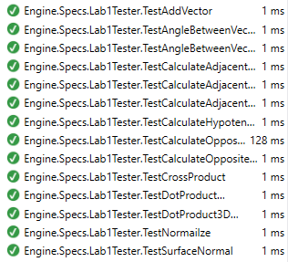

# Math/Physics Engine (Lab) Hints

## Introduction
There are often many ways to create code to achieve the results required for the lab specifications. Often some of the approaches require a little more knowledge than may have been covered in the introductory programming course(s), or with knowledge you may have gained through your own initiative. My hope here is to provide enough hints to make the solving of the lab questions a bit easier. I also plan on updating this file throughout the semester, and from year to year, to meet the demands of the labs and the students.

## General Hints
* In the `Engine` project there is a code file called `Validator.cs`. This code file is a general pupose validator that you can use for any part of your lab solutions. You can modify this file if you feel you need extra validation.
* You may not need all the classes in the `Classes` folder of the `Engine` project. There are a number of the classes that you will be coding in your labs. If you need another class make sure you use the same naming convention `Eng_ClassName.cs`.

### Running Tests
There are several ways to run the tests created. The simplest method is to right-click on the test class name, i.e. `Lab1Tester` and selct **Run Tests Ctrl+R,T**. If all the tests for the lab pass you should see something similar to the figure below:



### XML Documentation
The starting code has some initial XML comments. For example the `Eng_Point2D` class is shown below:

```csharp
using System;
using System.Collections.Generic;
using System.Linq;
using System.Text;
using System.Threading.Tasks;

namespace Engine.Classes
{
    /// <summary>
    /// This class simulates a point in 2D space.
    /// </summary>
    public class Eng_Point2D
    {
        /// <summary>
        /// This property represents the x-coordinate
        /// </summary>
        public double x { get; set; }
        /// <summary>
        /// This property represents the y-coordinate
        /// </summary>
        public double y { get; set; }

        /// <summary>
        /// Empty Eng_Point2D constructor
        /// </summary>
        public Eng_Point2D() { }

        /// <summary>
        /// Greedy Eng_Point2D constructor
        /// </summary>
        /// <param name="x">The x-coordinate</param>
        /// <param name="y">The y-coordinate</param>
        public Eng_Point2D(double x, double y)
        {
            this.x = x;
            this.y = y;
        }
    }
}
```

You are **NOT** required to add all the XML comments, lines beginning with `///`, but you are free to do so. Not adding the XML comments will only cause compiler warnings, which can be ignored. If you like clean code then add the XML comments. To add the XML comments simply wirite all the code you need, and test to make sure everything complies and tests correctly. Once that is accomlished, go back and add the `///` before each class, property, and public method. Visual Studio will add the appropriate XML comment block then all that is required is to fill in the details.

## Lab 1
This lab might appear to be the easiest, and the hardest. Easiest as the math covered to date is relatively uncomplicated. Hardest as you are jsut beginning with the project.

To start off with, the Visual Studio solution contains two seperate projects:
* A class library project `Engine`; this is where the bulk of the math and physics calculations are done.
* A class library project `Engine.Specs`; this is the unit testing project.

### Classes
What properties to you need for your classes? Each class in the **Classes** folder has a name that describes what the class is used for. You will then need to create a property for each value that is required to describe an instance of the class. The `Eng_Point2D` class is a good starting point for what your classes should look like. You only need to code the class(es) that is(are) mentioned in the lab specification document; if a class is not mentioned then you do not have to code it, and if there is math to be accomplished and no class is mentioned, then simply write code in `Calculator.cs`.

### Multiple Values

One of the challenges you will face is to return multiple values from a method. To do this you need a `Tuple<>`. A sample of a method that returns multiple values is shown in Listing 1.1.

#### Listing 1.1: Returning a `Tuple<>`
```csharp
return new Tuple<double, double>(value1, value2);
```

#### Listing 1.2: Calling a Method thet Returns a `Tuple<>`
```csharp
// calling a method that returns a Tuple<>
Tuple<double, double> results = Calculator.SomeMethodName(val1, val2);
```

Similarly, you will need to retrieve the values stored in a `Tuple<>`. This is demonstrated in Listing 1.2.

#### Listing 1.3: Retrieveing Values from a `Tuple<>`

```csharp
// Assert - did we get back the correct answer
Assert.Equal(expected1, Math.Round(actual.Item1, 4));
Assert.Equal(expected2, Math.Round(actual.Item2, 4));
```

### Calculated Properties
It is fairly easy to create a simple class with properties that are jsut readble and writeable (likely did that in your introductory programming class). Sometimes, however, you will need to set a property of a class that is based on one or more properties. Such a property is a calculated property. I feel this is a bit of a _shortcut_ to make programming easier. Listing 1.3 is an example of a class that has has a calcualted property, and a private method to set the property.

#### Listing 1.4: Calcualted Property
```csharp
public class ClassName
{
  public double one { get; set; }
  public double two { get; set; }
  public double calculated;

  public ClassName() {}
  
  public ClassName(double in1, double in2)
  {
    one = in1;
    two = in2;
    // calling private methods
    calculated = CalculatedProperty();
  }
  
  private double CalculatedProperty ()
  {
    // do some calculation(s) if necessary
    return someCalcualtedValue;
  }
}
```

## Lab 2
In lab 2 you are required to code the `Eng_Matrix4x4.cs` class file, and are told that you will need a property for each cell of the matrix. I find the best way is to name them in relation to their row anc column number (i.e. `m11`, `m12`, etc.). When creating the 4x4 matrix it is almost always going to have the last row as `[0   0   0  1]` so you could set defaults for this row; there will be exceptions when calculating an inverse so be aware of what type of matrix you are creating! (Follow a similar pattern for the `Eng_Matrix3x3.cs` class file.)

You are also asked to multiply a vector by a matrix. This can be done with nested loops but it is much faster if you follow the rules of matrix multiplication, as taught in class.

## Lab 3
In lab 3 you are asked to code the `Eng_PolarVector.cs` class file and have properties for the component form of the vector (the components are similar to the properties of the `Eng_Vector2D.cs` class). Just remember the trigonometry lesson and the work will be similar. The only problem is that you have to use degrees for the direction of the vector and the trig methods in code require radians. It is not possible to call your degree-radian conversion method you coded earlier in the `Calculator.cs` class file. Instead you will need to have this code inside your class file.

## Lab 4
